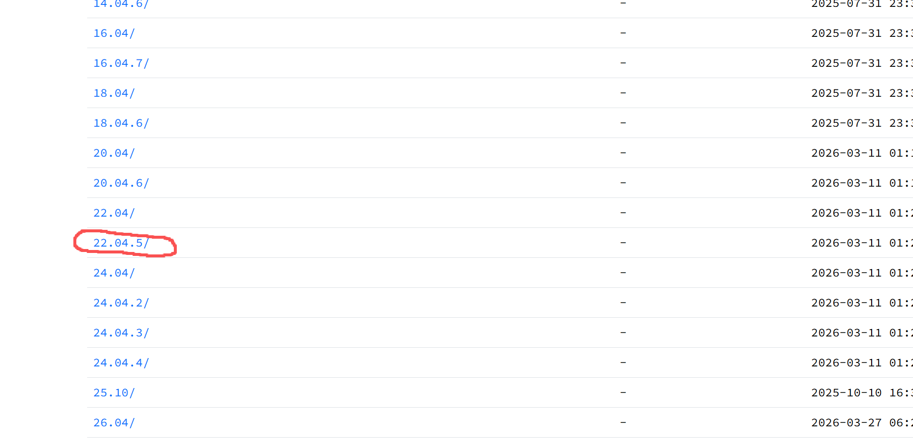
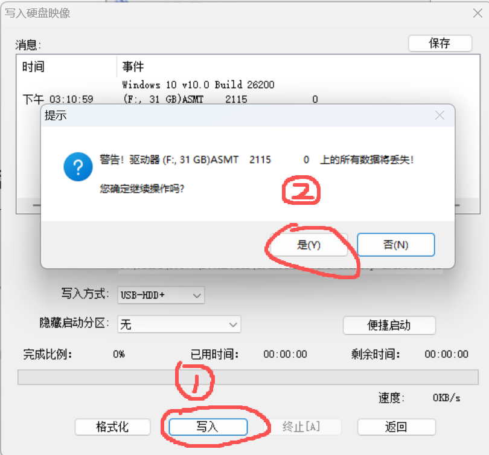
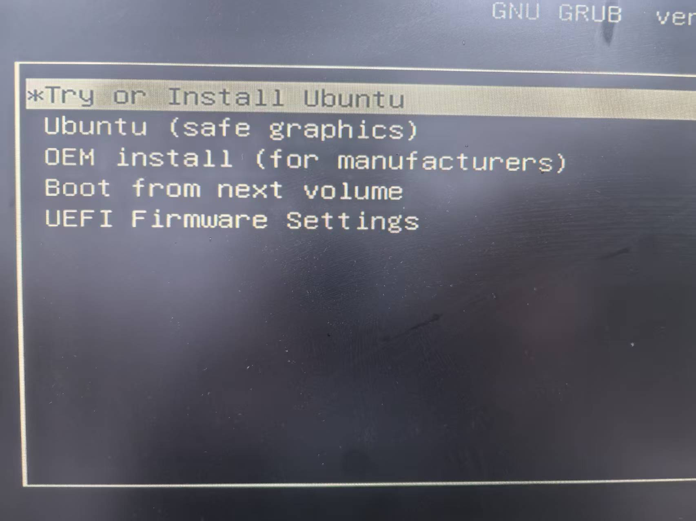
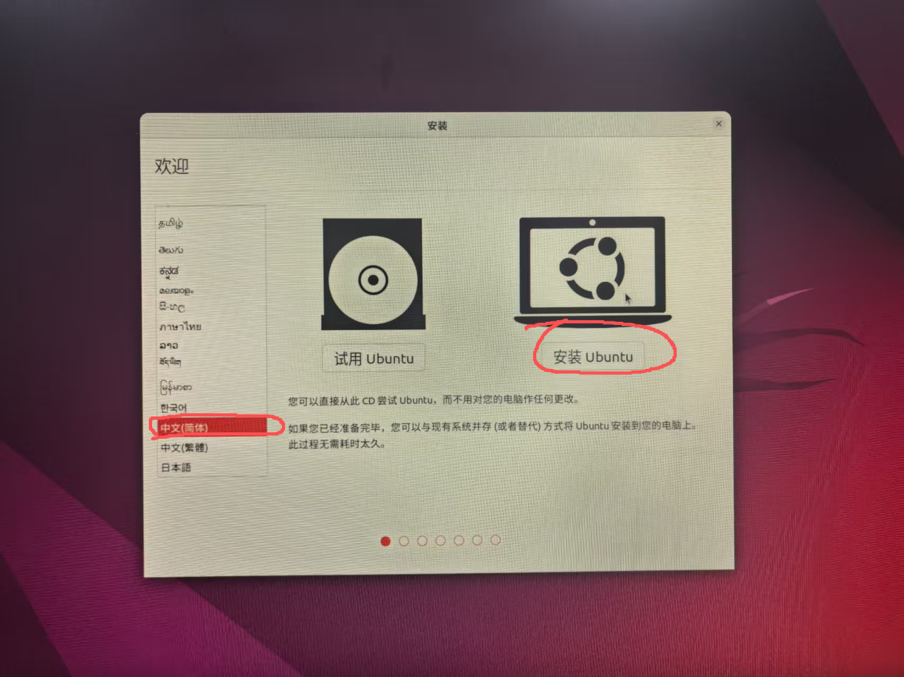
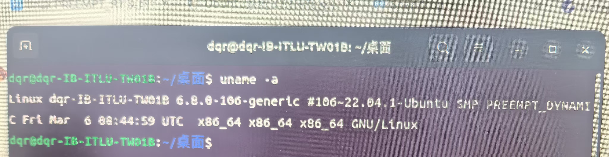
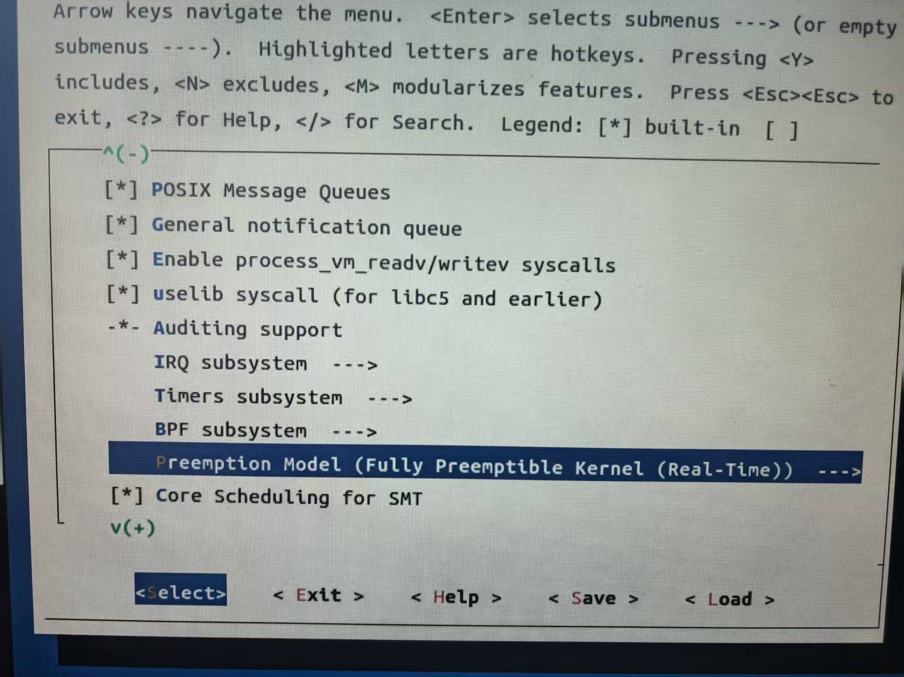
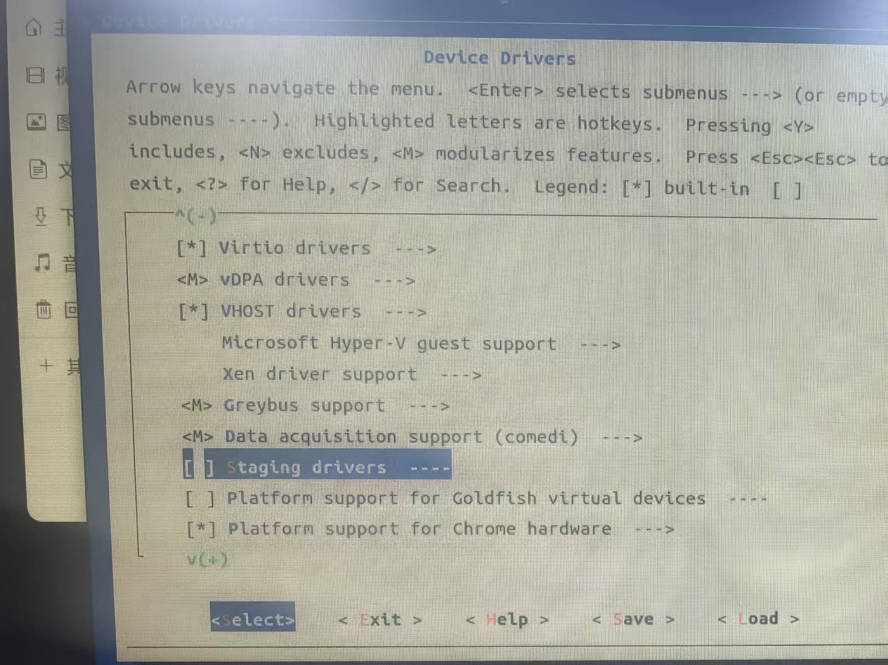
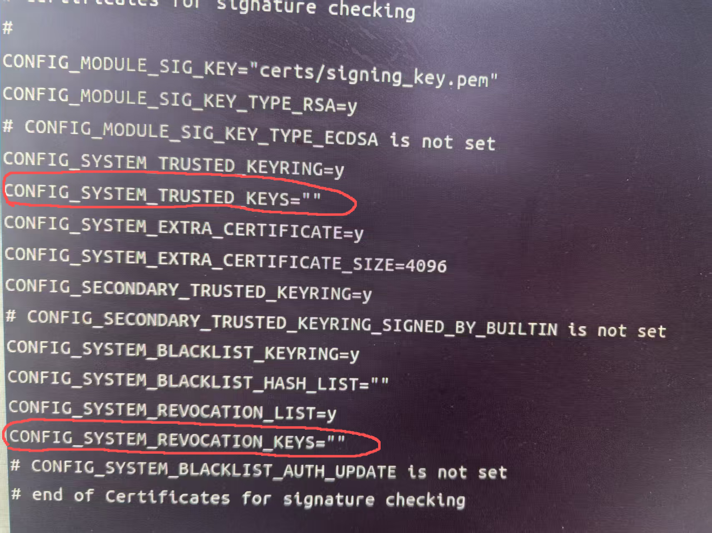
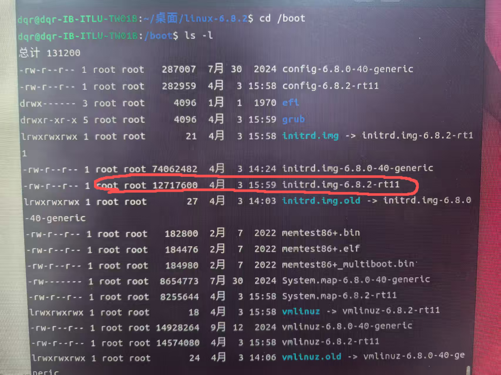

# CanEvo 实时系统安装、配置与验证指南

本文档覆盖 Ubuntu 22.04 安装、PREEMPT_RT 内核编译、CPU/IRQ 调优、CAN-FD 配置、实时线程验证与故障排查。

> 第一部分适合从零部署工控机；第二部分适合完成系统安装后的实时性能调优。

# 第一部分：Ubuntu 与 PREEMPT_RT 安装

本部分用于从零部署 x86 工控机。如果设备已经运行 Ubuntu 22.04 和 PREEMPT_RT 内核，可直接进入第二部分。

开始前请准备：

- 一台 x86_64 工控机，建议至少 4 个物理 CPU 核。
- 一个容量不小于 8 GB 的 U 盘；制作启动盘会清空其中的数据。
- Ubuntu 22.04 LTS Desktop ISO。
- 稳定的网络，以及不少于 30 GB 的可用磁盘空间（编译内核需要）。
- 工控机的重要数据备份和可恢复的原始内核。不要在无法停机或无法现场恢复的设备上首次验证自编译内核。

部署流程：

1. 下载 Ubuntu ISO 并制作启动盘。
2. 安装并更新 Ubuntu。
3. 下载严格匹配的 Linux 源码和 PREEMPT_RT 补丁。
4. 编译、安装并启动 RT 内核。
5. 按第二部分完成 CPU、IRQ、CAN-FD 和应用线程调优。

## 1. 下载镜像并制作启动盘

### 1.1 下载 Ubuntu 22.04 LTS

可从 [Ubuntu 镜像站](https://mirrors.qlu.edu.cn/ubuntu-releases/) 下载 Ubuntu 22.04 LTS Desktop ISO。下载后建议校验镜像站提供的 SHA256，避免镜像损坏。

选择 Ubuntu 22.04 LTS：




下载 `desktop-amd64.iso`：


### 1.2 写入 U 盘

Windows 推荐使用 Rufus 或 balenaEtcher，Linux 可使用“启动盘创建器”。选择 ISO 和目标 U 盘后开始写入；务必再次确认目标盘，写入操作会清空 U 盘。

以下图片为使用 UltraISO 时的操作参考：


1. 启动写盘工具并打开下载好的 ISO。


2. 插入 U 盘，选择“写入硬盘映像”。


3. 核对目标 U 盘后开始写入。


> 图片中的盘符和文件名仅为示例，以现场设备为准。




## 2. 安装 Ubuntu 22.04

> 安装系统可能格式化硬盘。执行前确认目标磁盘，并备份原系统和业务数据。

### 2.1 从 U 盘启动

关机后插入启动盘，再启动工控机并从 BIOS/UEFI 启动菜单选择该 U 盘。

### 2.2 启动安装程序

选择 `Try or Install Ubuntu`：



### 2.3 选择安装语言

选择“中文（简体）”，然后点击“安装 Ubuntu”：



### 2.4 选择键盘布局

根据实际键盘选择布局；普通中文/英文键盘通常可选择 `Chinese`：


### 2.5 选择安装类型

工控机建议选择“最小安装”，减少无关桌面服务：


### 2.6 选择磁盘方案

根据现场要求选择整盘安装或手动分区。双系统或保留数据时必须选择手动分区，不能直接擦除磁盘。


确认分区变更后继续：


### 2.7 创建用户

设置主机名、用户名和密码；部署后应妥善保存管理员凭据。


### 2.8 完成安装并重启

```bash
# 如果没有自动重启，就打开终端输入这个命令
sudo reboot
```


## 3. 更新基础系统

```bash
sudo apt update
sudo apt full-upgrade -y
sudo reboot
```

重启后记录当前内核和架构，后续排查时需要：

```bash
uname -a
uname -m
```

## 4. 编译并安装 PREEMPT_RT 内核

### 4.1 选择严格匹配的源码与补丁

Linux 源码版本和 RT 补丁的基础版本必须完全一致。例如本文示例必须同时使用：

- Linux 源码：`linux-6.8.2.tar.xz`
- RT 补丁：`patch-6.8.2-rt11.patch.gz`

不要把 `6.8.2` 源码与其他版本的 RT 补丁混用。当前 Ubuntu generic 内核版本只用于复制初始配置，不决定 RT 补丁版本。

下图中的 `6.8.0-106-generic` 只是现场记录示例，实际版本以 `uname -r` 输出为准：



RT 补丁目录：<https://mirrors.edge.kernel.org/pub/linux/kernel/projects/rt/6.8/>


Linux 源码目录：<https://mirrors.edge.kernel.org/pub/linux/kernel/v6.x/>
例图：


### 4.2 安装编译依赖

```bash
sudo apt install -y \
  build-essential bc libncurses-dev flex bison openssl libssl-dev \
  dkms libelf-dev libudev-dev libpci-dev libiberty-dev autoconf \
  fakeroot dwarves
```

### 4.3 解压并应用补丁

```bash
tar -xJf linux-6.8.2.tar.xz
gunzip -k patch-6.8.2-rt11.patch.gz
cd linux-6.8.2
patch -p1 < ../patch-6.8.2-rt11.patch
cp -v "/boot/config-$(uname -r)" .config
make olddefconfig
```

`patch` 命令不应出现 failed hunk。出现冲突时应停止并重新核对源码与补丁版本。

### 4.4 配置 RT 内核

```bash
make menuconfig
```

按照下面设置

General Setup -> Preemption Model 设置为 Fully Preemptible Kernel(RT)
Device Drivers -> staging drivers 设置为 不开启 ——[ ] 默认开启，按N取消
以下是示例图：
选中General Setup，回车进入


选中Preemption Model，回车进入


选中 Fully Preemptible Kernel(RT)，回车，看到有X表示选中了


点击Esc,回到开始的地方（有General Setup的那个界面)，选中Device Drivers，回车


找到staging drivers，选中，按键盘的N键，【】是空的表示成功


一直点Esc，直到Yes界面的出现，选择Yes，保存。

使用内核自带的配置工具修改相关选项，避免手工编辑时混入中文引号：

```bash
scripts/config --set-str SYSTEM_TRUSTED_KEYS ""
scripts/config --set-str SYSTEM_REVOCATION_KEYS ""
scripts/config --disable DEBUG_INFO
make olddefconfig
```

例图：




### 4.5 编译和安装

```bash
make -j$(nproc)

# 安装模块
sudo make INSTALL_MOD_STRIP=1 modules_install

# 安装内核；Ubuntu 通常会自动生成 initramfs
sudo make INSTALL_MOD_STRIP=1 install

# 更新引导
sudo update-grub
```

确认内核和 initramfs 已生成：

```bash
ls -lh /boot/vmlinuz-*rt* /boot/initrd.img-*rt*
```

文件大小因配置而异，重点确认 RT 内核和对应 initramfs 同时存在：


### 4.6 重启并验证

```bash
sudo reboot
```

重启后执行：

```bash
uname -a
grep PREEMPT_RT "/boot/config-$(uname -r)"
```

`uname -a` 应包含 `PREEMPT_RT`，配置文件应包含 `CONFIG_PREEMPT_RT=y`。同时保留原 generic 内核作为 GRUB 恢复入口；如果 RT 内核无法启动，可在 GRUB 的 Advanced options 中选择原内核。


# 第二部分：实时系统规划、调优与验证

本文整理当前 ARM/NIIC 环境的配置思路，并给出迁移到 x86 工控机 PREEMPT_RT 内核时的推荐配置。目标是让 CSP 控制循环尽量稳定地按同步周期发送 SYNC/PDO，避免从站因同步抖动切换到 PP。

## 1. 背景和约束

CanEvo CSP 模式对主站同步周期要求很高：

- 连续 3 次同步周期偏差超过 ±150 us，关节可能自动切换到 PP。
- 单次同步周期偏差超过 ±200 us，关节可能自动切换到 PP。

因此要同时关注两件事：

- 用户态实时线程是否准时醒来。
- CAN 帧真正出现在总线上的时间是否稳定。

实时内核只能保证第一层。第二层还取决于 CAN 控制器、驱动、IRQ 亲和性、发送队列、总线负载和适配器硬件。USB 转 CAN 通常不适合这类 ±20 us/±50 us 级同步场景，建议优先使用板载 CAN、PCIe CAN、SPI CAN 或工业 CAN-FD 卡。

## 2. x86 PREEMPT_RT 内核确认

确认当前运行的是 RT 内核：

```bash
uname -a
```

应看到类似：

```text
PREEMPT_RT
```

也可以检查：

```bash
zcat /proc/config.gz | grep CONFIG_PREEMPT_RT
```

期望：

```text
CONFIG_PREEMPT_RT=y
```

安装测试工具：

```bash
sudo apt update
sudo apt install -y rt-tests linux-tools-common cpufrequtils ethtool can-utils
```

## 3. CPU 规划

建议至少 4 核：

| 角色 | 推荐 CPU | 说明 |
| --- | --- | --- |
| 实时控制线程 | CPU1 | 独占隔离核 |
| CAN IRQ / CAN Rx 线程 | CPU3 | 与实时线程分开，避免抢占 |
| 系统普通任务 | CPU0,2 | systemd、桌面、SSH、日志等 |

如果工控机有 8 核，可以采用：

| 角色 | 推荐 CPU |
| --- | --- |
| 实时控制线程 | CPU1 |
| CAN IRQ / SDK Rx | CPU3 |
| 系统普通任务 | CPU0,2,4,5,6,7 |

注意：不要把实时线程和 CAN IRQ/Rx 线程放在同一个 CPU 上，除非你明确需要缩短跨核路径并已经测过效果。默认推荐分开，因为 CAN IRQ/Rx 可能打断控制线程。

## 4. GRUB 启动参数

编辑：

```bash
sudo nano /etc/default/grub
```

4 核示例，隔离 CPU1：

```bash
GRUB_CMDLINE_LINUX_DEFAULT="quiet splash isolcpus=1 nohz_full=1 rcu_nocbs=1 rcu_nocb_poll irqaffinity=0,2,3 nmi_watchdog=0 audit=0 nosoftlockup idle=poll intel_idle.max_cstate=0 processor.max_cstate=0 pcie_aspm=off usbcore.autosuspend=-1"
```

8 核示例，隔离 CPU1：

```bash
GRUB_CMDLINE_LINUX_DEFAULT="quiet splash isolcpus=1 nohz_full=1 rcu_nocbs=1 rcu_nocb_poll irqaffinity=0,2,3,4,5,6,7 nmi_watchdog=0 audit=0 nosoftlockup idle=poll intel_idle.max_cstate=0 processor.max_cstate=0 pcie_aspm=off usbcore.autosuspend=-1"
```

更新并重启：

```bash
sudo update-grub
sudo reboot
```

重启后确认：

```bash
cat /proc/cmdline
cat /sys/devices/system/cpu/isolated
cat /sys/devices/system/cpu/nohz_full
```

期望隔离 CPU 显示为：

```text
1
```

## 5. systemd CPU 亲和性

避免系统服务跑到隔离核。

编辑：

```bash
sudo nano /etc/systemd/system.conf
sudo nano /etc/systemd/user.conf
```

4 核示例：

```ini
CPUAffinity=0 2 3
```

8 核示例：

```ini
CPUAffinity=0 2 3 4 5 6 7
```

重启：

```bash
sudo reboot
```

## 6. CPU 频率和省电设置

建议关闭动态调频和深 C-state。

临时设置 governor：

```bash
sudo cpupower frequency-set -g performance
```

如果没有 `cpupower`：

```bash
sudo apt install -y linux-tools-$(uname -r)
```

确认：

```bash
cat /sys/devices/system/cpu/cpufreq/policy*/scaling_governor
```

期望：

```text
performance
```

BIOS/UEFI 建议：

- Disable C-States 或限制到 C1。
- Disable Intel SpeedStep / Speed Shift，或固定 Performance 模式。
- Disable Turbo Boost，优先稳定延迟而不是峰值性能。
- Disable Hyper-Threading，或不要把实时线程放在 SMT sibling 上。
- Disable ASPM/PCIe power saving。

## 7. CAN-FD 配置

### 7.1 安装 KH-UCANFD 驱动

使用昆宏 KH-UCANFD 适配器时，先安装对应驱动：

```bash
sudo apt update
sudo apt install -y wget unzip

wget https://gitee.com/ChengDu-KunHong/KH-UCANFD_Linux_SDK/releases/download/latest/KH-UCANFD_Linux_SDK.zip
unzip KH-UCANFD_Linux_SDK.zip
cd KH-UCANFD_Linux_SDK-*/
sudo ./build.sh
```

确认驱动模块已经加载：

```bash
lsmod | grep kcan
```


如果没有输出，检查驱动编译日志，并确认当前内核已安装对应的内核头文件。

### 7.2 配置 CAN-FD 接口

配置 CAN-FD：

```bash
sudo ip link set can0 down 2>/dev/null || true
sudo ip link set can0 type can bitrate 1000000 dbitrate 5000000 fd on
sudo ip link set can0 txqueuelen 1
sudo ip link set can0 up
```

查看状态：

```bash
ip -details link show can0
```

降低 `txqueuelen` 可以减少内核队列积压，让发送时间更接近实时线程调度点。多关节报文较多时可以对比 `txqueuelen 1`、`2`、`4` 的总线实际抖动，最终以示波器/逻辑分析仪结果为准。

## 8. CAN IRQ 亲和性

找到 CAN IRQ：

```bash
grep -n "can0\|can\|kcan\|pcan\|mttcan" /proc/interrupts
```

假设 IRQ 号是 `202`，把它放到 CPU3：

```bash
echo 3 | sudo tee /proc/irq/202/smp_affinity_list
```

确认：

```bash
cat /proc/irq/202/smp_affinity_list
```

建议：

- 实时控制线程在 CPU1。
- CAN IRQ 在 CPU3。
- SDK Rx 线程也在 CPU3，或者放在另一个非隔离但低干扰 CPU。
- 不要让其他 IRQ 进入 CPU1。

可以把大多数 IRQ 排除出 CPU1：

```bash
for irq in /proc/irq/[0-9]*; do
  echo 0,2,3 | sudo tee "$irq/smp_affinity_list" >/dev/null 2>&1 || true
done
```

然后单独确认 CAN IRQ：

```bash
grep -n "can0\|can\|kcan\|pcan" /proc/interrupts
```

## 9. 验证 CAN 总线实际抖动

软件时间戳只能看到主机侧，不等于从站看到的总线时间。CSP 最终要看 CAN 总线上的 SOF 间隔。

推荐验证方式：

1. 用示波器或逻辑分析仪接 CAN_H/CAN_L，解码 SYNC 帧。
2. 统计相邻 SYNC 帧 SOF 间隔。
3. 检查是否有连续 3 次超过 ±150 us，或单次超过 ±200 us。

辅助软件观测：

```bash
candump -tz can0
```

注意：`candump` 时间戳包含驱动和内核路径影响，不能替代总线物理层测量。

## 10. 故障排查清单

### 线程抖动大

- `uname -a` 是否为 PREEMPT_RT。
- 实时线程是否绑定隔离核。
- `mlockall()` 是否成功。
- 是否用 root 或具备 `CAP_SYS_NICE`。
- CPU governor 是否为 performance。
- BIOS 是否关闭深 C-state、Turbo、SMT。
- 隔离核是否仍有 IRQ。

### 线程稳定但从站仍切 PP

- 是否使用 USB-CAN。
- CAN IRQ 是否和实时线程抢同一个核。
- CAN 发送队列是否过长。
- 总线负载是否过高。
- 多关节 PDO 数量是否导致总线占用接近周期上限。
- 是否在实时循环中做了 SDO、日志打印、动态分配、阻塞调用。
- 是否用示波器确认 SYNC 帧 SOF 间隔。

### 多关节比单关节更容易切 PP

- 多关节每周期 CAN 帧更多，总线占用更高。
- RxPDO 逐个发送会增加周期内帧尾部延迟。
- 检查 CAN-FD 数据段波特率是否为 5 Mbps。
- 降低关节数量或周期频率做 A/B 测试。
- 用示波器观察每周期第一帧 SYNC 和后续 RxPDO 的相对时间。

## 11. 目标状态

理想运行状态：

- 实时线程 `SCHED_FIFO 99`，独占隔离核。
- SDK Rx 线程 `SCHED_FIFO 90`，非隔离核。
- CAN IRQ 固定到非隔离核。
- 系统普通任务不进入隔离核。
- CPU 固定 performance，关闭深度省电。
- 使用非 USB 的 CAN-FD 控制器。
- 总线物理层 SYNC 周期满足 CSP 阈值。
