## 一、镜像源下载和制作启动盘

### 1.复制下面链接进入下载

https://mirrors.qlu.edu.cn/ubuntu-releases/

### 2.点击下载22.04.5版本


### 3.点击下载

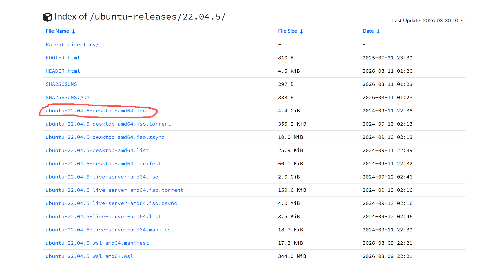


### 4.下载软碟通

https://ultraiso.net/xiazai.html
通过这个网址进入下载，选择免费下载试用


### 5.解压缩后，运行exe


### 6.点击输入注册码，输入正确的信息（如果不好使可以直接点击继续试用）

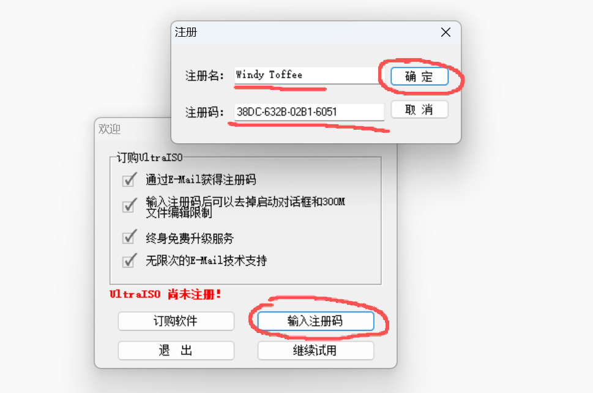
注册名*：Windy Toffee
注册码：38DC-632B-02B1-6051


### 7.打开软碟通软件


### 8.点击左上角 文件 -> 打开

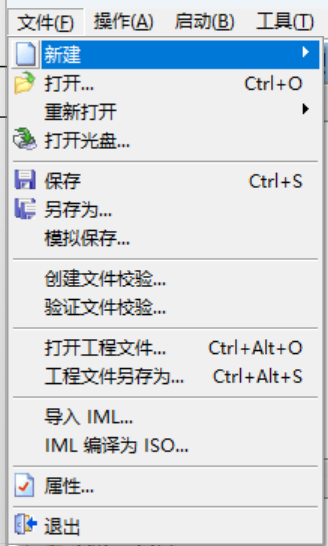


### 9.选择下载好的镜像文件包，点击确定，然后插入u盘


### 10.点击菜单栏的启动，选择写入软盘映像

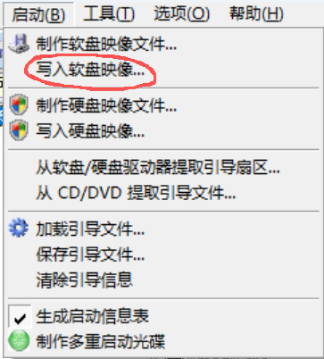


### 11.选择插入的U盘，其他的不变

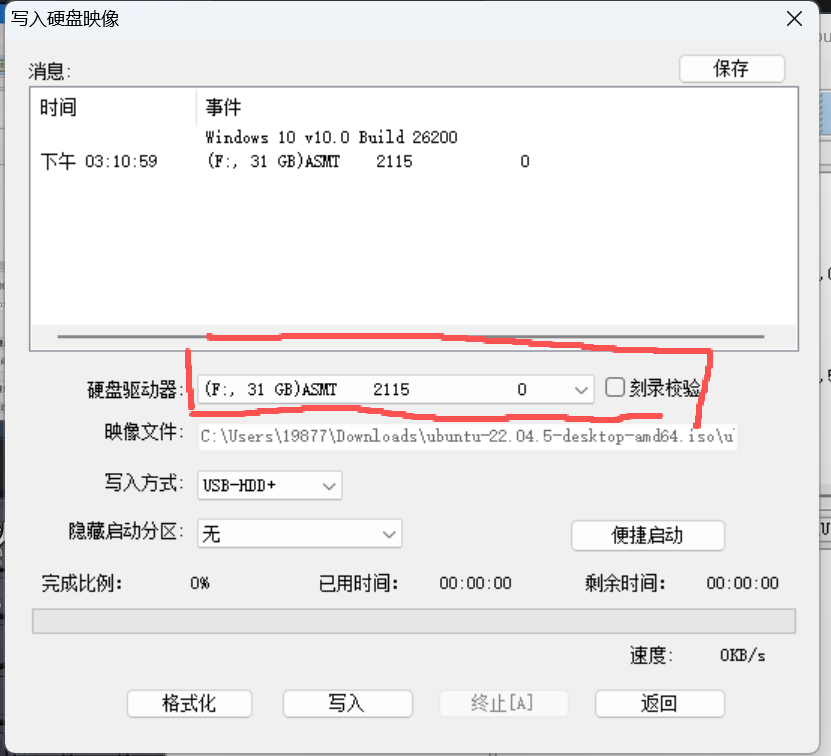


### 12.点击写入，点击是


## 二、工控机安装系统

### 1.将启动盘插入到工控机上，然后再通电，启动工控机

### 2.启动后，选择Try or Install Ubuntu


### 3.选择中文简体，然后点击安装Ubuntu


### 4.选择Chinese，点击继续

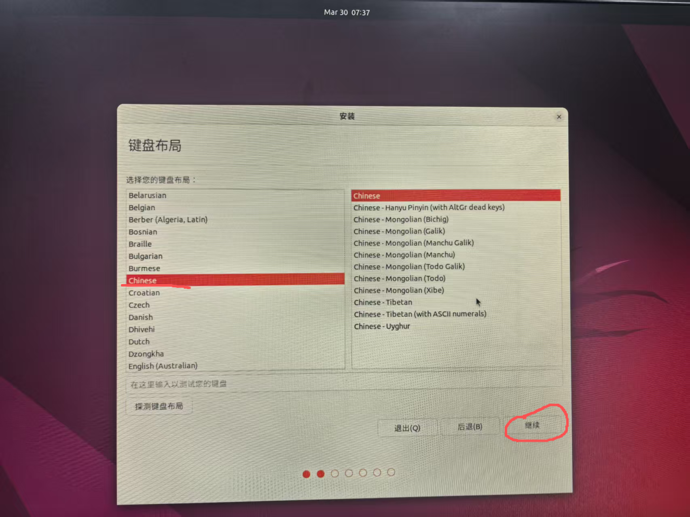

### 5.选择最小安装，点击继续

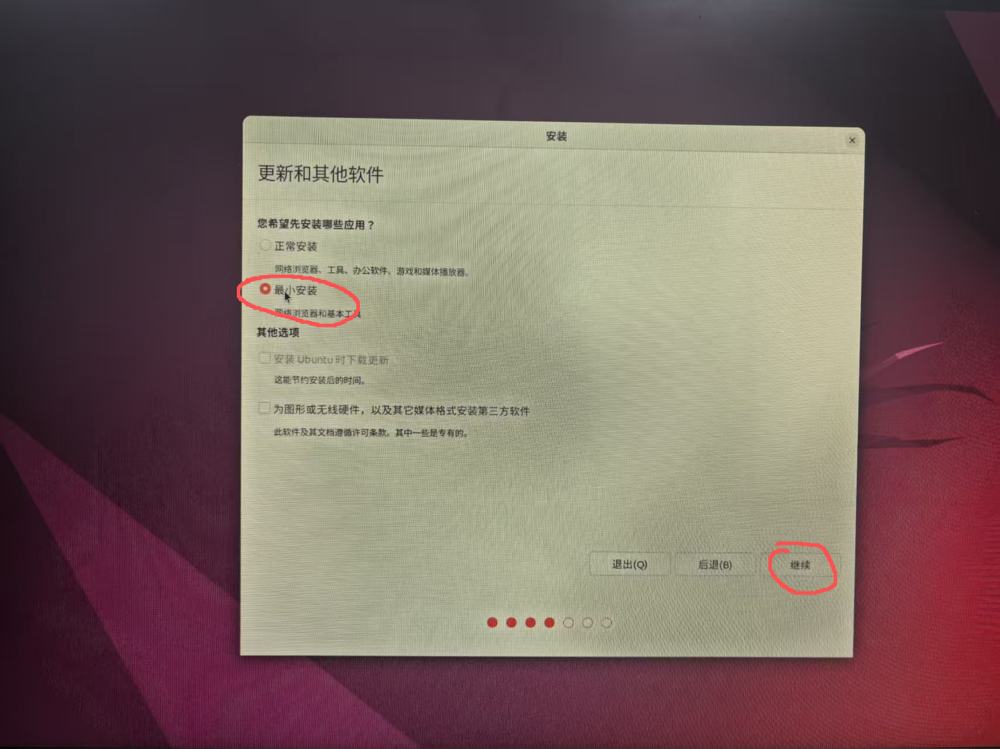

### 6.根据需要选择安装需要的操作

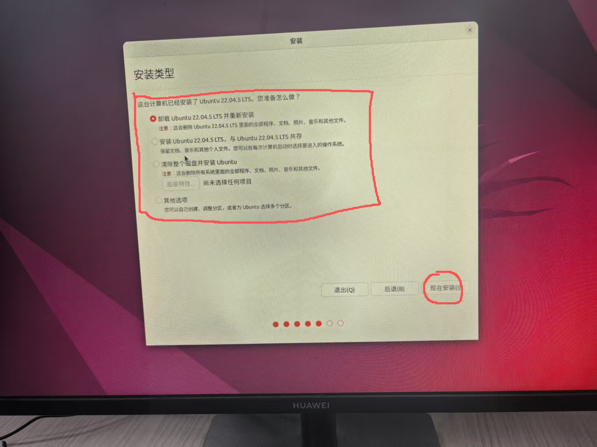

### 7.点击继续


### 8.输入对应信息，点击继续

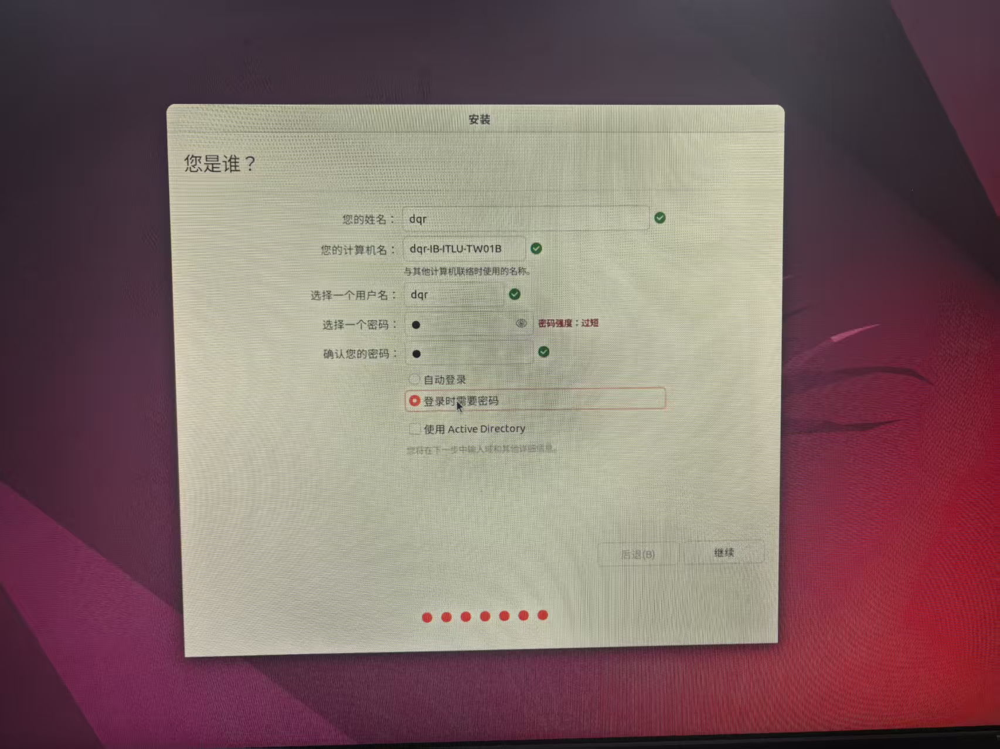

### 9.下载完后，先拔掉U盘，再重启

```
# 如果没有自动重启，就打开终端输入这个命令
reboot
```


### 10.根据提示选择进入系统就可以


## 三、工控机的配置

### 1、更新

```
# 更新
sudo apt update
```


### 2、安装实时内核

```
# 查看当前Ubuntu内核版本，选择相近版本的linux内核源码和补丁
uname -a
```

未安装RT补丁时，Ubuntu22.04的内核为：6.8.0-106-generic


下载相近的内核补丁https://mirrors.edge.kernel.org/pub/linux/kernel/projects/rt/6.8/


下载相近的内核源码https://mirrors.edge.kernel.org/pub/linux/kernel/v6.x/
例图：


```
# 安装可能需要的依赖
sudo apt-get install libncurses-dev flex bison openssl libssl-dev dkms libelf-dev libudev-dev libpci-dev libiberty-dev autoconf fakeroot dwarves
```

```
解压内核源码和补丁：
tar -xJvf linux-6.8.2.tar.xz ##解压
gunzip patch-6.8.2-rt11.patch.gz ##解压
cd linux-6.8.2 ##进入内核源码目录
patch -p1 < ../patch-6.8.2-rt11.patch ##应用补丁
cp -v /boot/config-6.8.0-40-generic .config##复制现有的内核配置文件
```

```
# 进入配置页面
make menuconfig
```

按照下面设置

General Setup -> Preemption Model 设置为 Fully Preemptible Kernel(RT)
Device Drivers -> staging drivers 设置为 不开启 ——[ ] 默认开启，按N取消
以下是示例图：
选中General Setup，回车进入

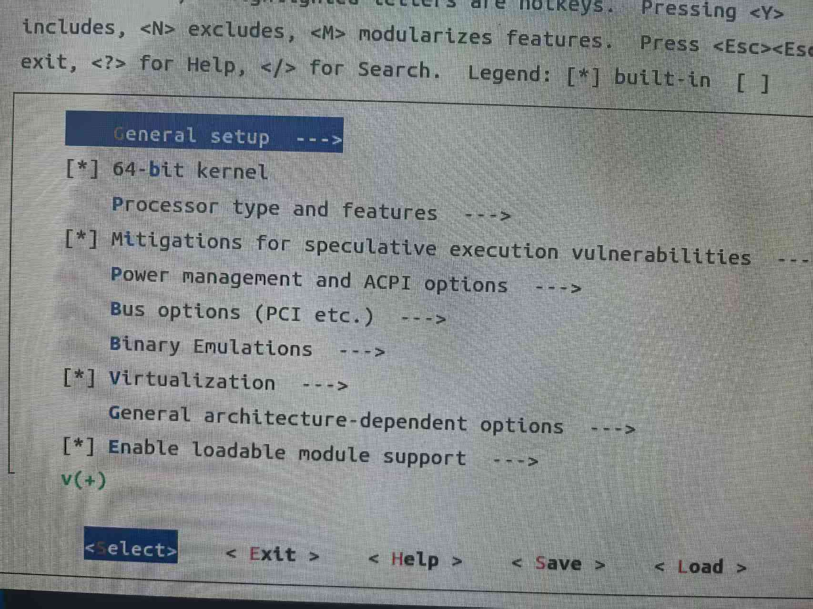
选中Preemption Model，回车进入


选中 Fully Preemptible Kernel(RT)，回车，看到有X表示选中了

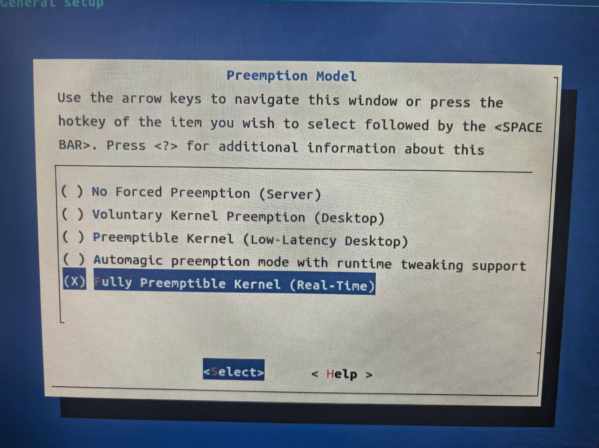
点击Esc,回到开始的地方（有General Setup的那个界面)，选中Device Drivers，回车

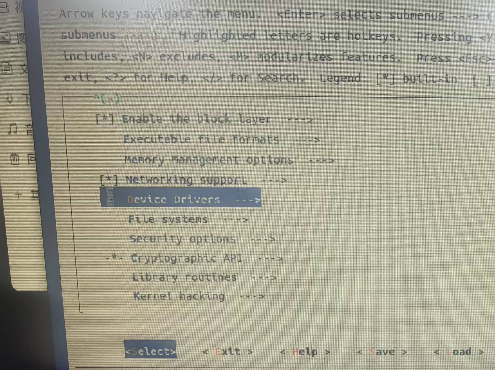
找到staging drivers，选中，按键盘的N键，【】是空的表示成功


一直点Esc，直到Yes界面的出现，选择Yes，保存。

```
# 编辑 .config 文件：

vi .config

# 改成:
# CONFIG_SYSTEM_TRUSTED_KEYS=“”
# CONFIG_SYSTEM_REVOCATION_KEYS=“”
# CONFIG_DEBUG_INFO=n
```

例图：


完成配置后，执行下面指令：

```
# 编译内核(需要点时间)
cd /path/to/linux-6.8.2
make -j$(nproc)

# 安装模块
sudo make INSTALL_MOD_STRIP=1 modules_install

# 安装内核（跳过自动生成 initramfs）
sudo make install INSTALL_MOD_STRIP=1

# 手动生成精简的 initramfs
# 修改配置
sudo sed -i 's/^MODULES=.*/MODULES=dep/' /etc/initramfs-tools/initramfs.conf
sudo sed -i 's/^COMPRESS=.*/COMPRESS=xz/' /etc/initramfs-tools/initramfs.conf

# 生成initramfs
sudo mkinitramfs -o /boot/initrd.img-6.8.2-rt11 6.8.2-rt11

# 更新引导
sudo update-grub
```

```
# 查看编译后核心，注意核心大小
cd /boot
ls -l
```

差不多这个大小


重启系统并查看当前 Ubuntu 内核版本，显示带有PREEMPT_RT内核

```
sudo reboot
uname -a
```

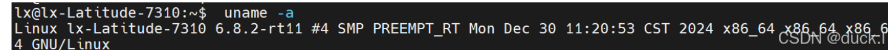

### 3、配置隔离的cpu，以下是对隔离CPU2的示例，用户可以自行选择需要隔离的CPU

```
# 打开配置页面
sudo nano /etc/default/grub

# 将GRUB_CMDLINE_LINUX_DEFAULT那一行改为

GRUB_CMDLINE_LINUX_DEFAULT="quiet splash \
isolcpus=2 nohz_full=2 rcu_nocbs=2 rcu_nocb_poll \
nohz=on nosmt \
irqaffinity=0,1,3 \
rcupdate.rcu_expedited=1 \
kernel.nmi_watchdog=0 \
audit=0 \
mce=off \
idle=poll \
nosoftlockup \
page_alloc.shuffle=0"

# 
sudo nano /etc/systemd/system.conf
把CPUAffinity = 改成CPUAffinity =0 1 3
# 
sudo nano /etc/systemd/user.conf
在最后加上CPUAffinity =0 1 3

# 更新并重启
sudo update-grub
reboot
```

例图：

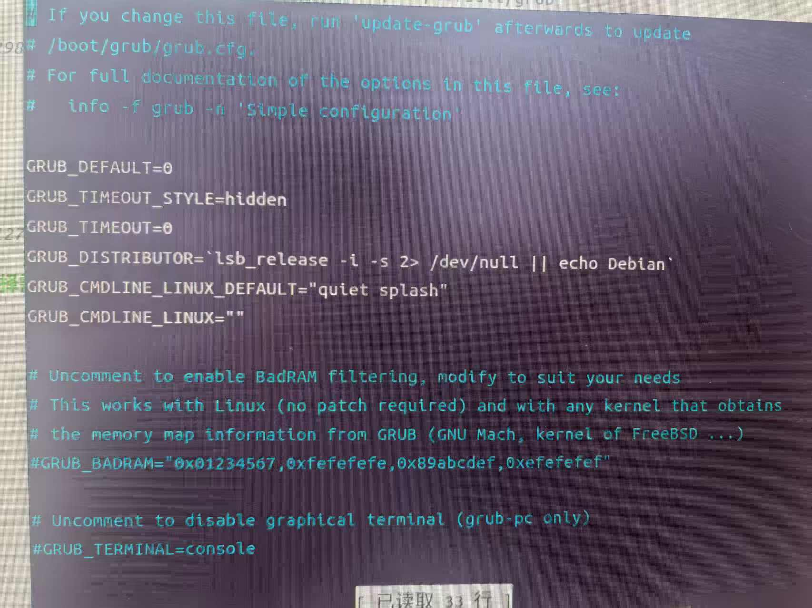

改成

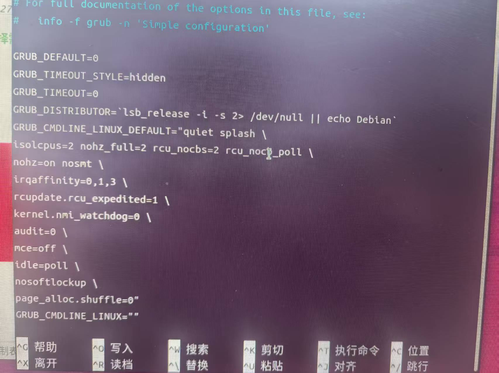
ctrl+x保存，输入y确认

sudo nano /etc/systemd/system.conf

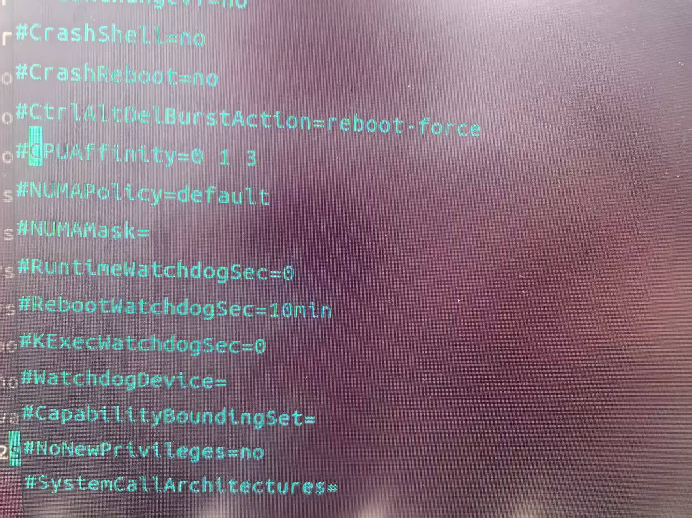

sudo nano /etc/systemd/user.conf

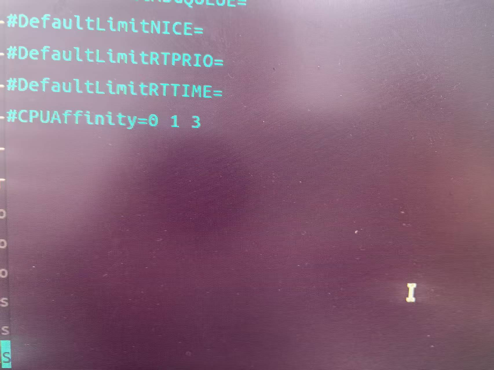

### 4、安装驱动

```
# 如果未安装wget，先执行这一步，如果有可以忽略
sudo apt install -y wget

# 下载驱动
wget https://gitee.com/ChengDu-KunHong/KH-UCANFD_Linux_SDK/releases/download/latest/KH-UCANFD_Linux_SDK.zip

# 解压并进入 SDK 目录
unzip KH-UCANFD_Linux_SDK.zip && cd KH-UCANFD_Linux_SDK-*/

# 进入 SDK 目录，执行以下命令完成一键安装
./build.sh
```

```
# 检查是否成功
lsmod | grep kcan
```

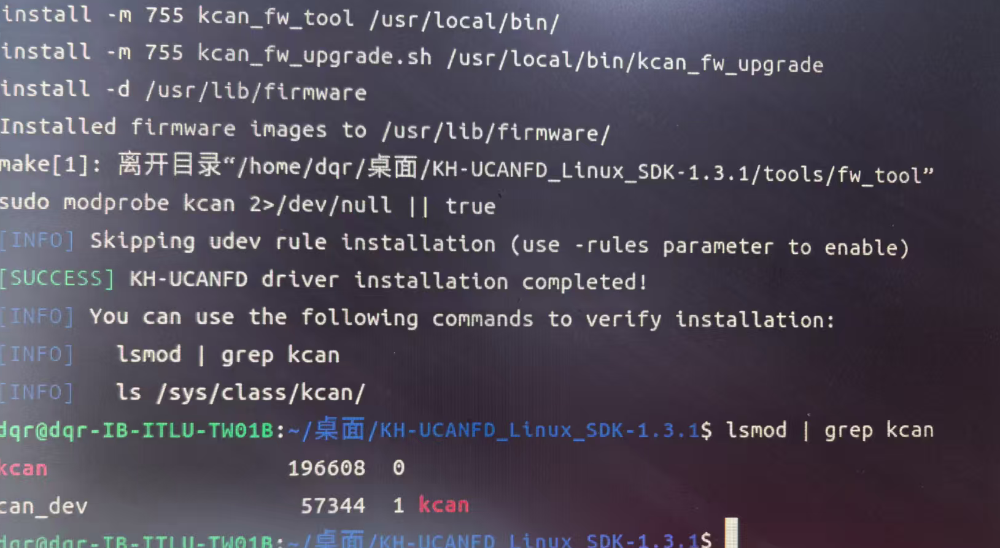
看到kcan就成功了

### 5、配置CAN-FD

```
sudo ip link set can0 type can bitrate 1000000 dbitrate 5000000 fd on
sudo ip link set can0 up

# 设置运行的进程不要跑到cpu2上
sudo ps -eo pid | awk 'NR>1' | xargs -I {} sudo taskset -pc 0,1,3 {} 2>/dev/null
sudo find /proc/irq -maxdepth 1 -type d -name "[0-9]*" | sort -n | xargs -I {} sudo sh -c "echo 0,1,3 > {}/smp_affinity_list" 2>/dev/null
```


### 6、一些用得上的配置

```
# Cmake
sudo apt update
sudo apt install cmake

# 下载可以看到当前实时系统的性能(可能会卡，慎用)
sudo apt-get install rt-tests ##下载rt-test
sudo cyclictest -l10000000 -m -t5 -p99 -i2 -h100
```


